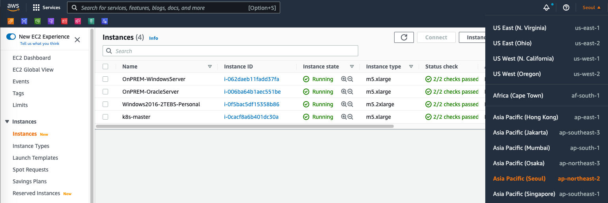

# Seoul Summit 2022 - DBforMSA Workshop

---

**Seoul Summit 2022 - DBfor MSA Workshop에 오신 여러분 환영 합니다.**

**오늘 Workshop에서는 엔터프라이즈 모놀리틱 디비를 목적에 맞는 다양한 디비로 분리하는 실습을 진행하시게 됩니다.**

---

#### Workshop 순서

```
workshop00 - 키페어 생성 및 실습 환경 구성

workshop01 - MongoDB를 활용한 CRM 리포트 서비스 분리

workshop02 - Redis를 활용한 실시간 리더보드 만들기

workshop03 - Redis를 활용한 한정판매 이벤트 처리하기

workshop04 - DynamoDB를 활용하여 구매내역 조회 서비스 전환하기

workshop99 - 실습 환경 및 리소스 삭제 (워크샵 수행 후 반드시 수행 필요)
```

---

#### 주의 사항 - 필독!!!

```
% AWS Console UI는 고객 편의성을 위해서 계속 변경되고 있습니다. 
% Workshop Guide의 UI와 실제 AWS Console UI가 조금 다를 수 있습니다.

% 오늘 Workshop은 실습 비용을 줄이기 위해서 하나의 EC2 위에 Oracle, Redis, MongoDB를 모두 설치해서 사용하게 됩니다.
% 실제 Production 환경에서 AWS가 제공하는 Managed 서비스인 RDS, ElatiCache, DocumentDB를 사용하게 되면 
% HA, Backup, Security, Replication등 다양한 기능을 손쉽게 사용 하실 수 있습니다. 

% Workshop을 끝내실 경우 꼭 Workshop99 과정을 수행하셔서, Resource를 삭제하셔야 합니다.
% Resource를 삭제하지 않을 경우 AWS Service 이용 요금이 계속 과금 될 수 있습니다.

% Workshop은 Seoul Region(ap-northeast-2) 에서 진행됩니다. 
% 다른 Region에서 진행시 AMI 접근이 불가능합니다.
% Console 우측 상단에서 Seoul(서울) Region을 선택합니다.
```



---

[워크샵 시작 - workshop00(실습환경구성) ](./workshop00/workshop00.md) 

