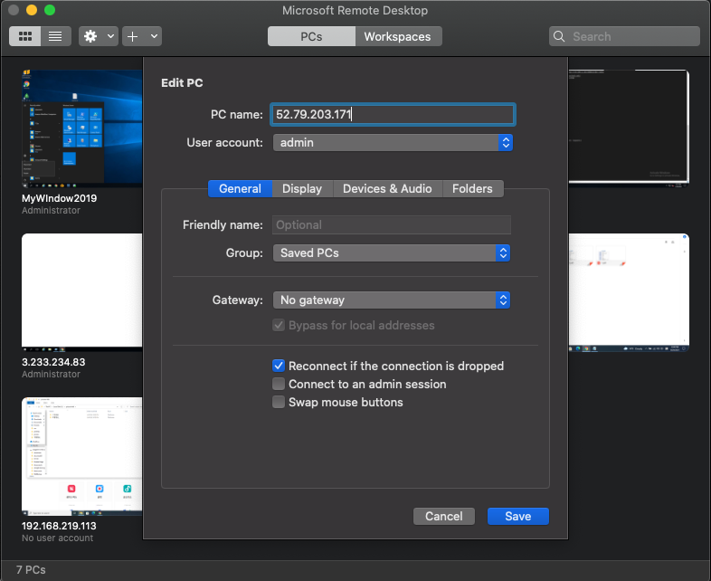
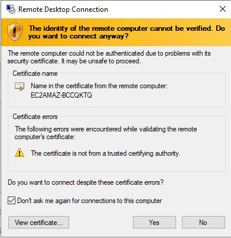
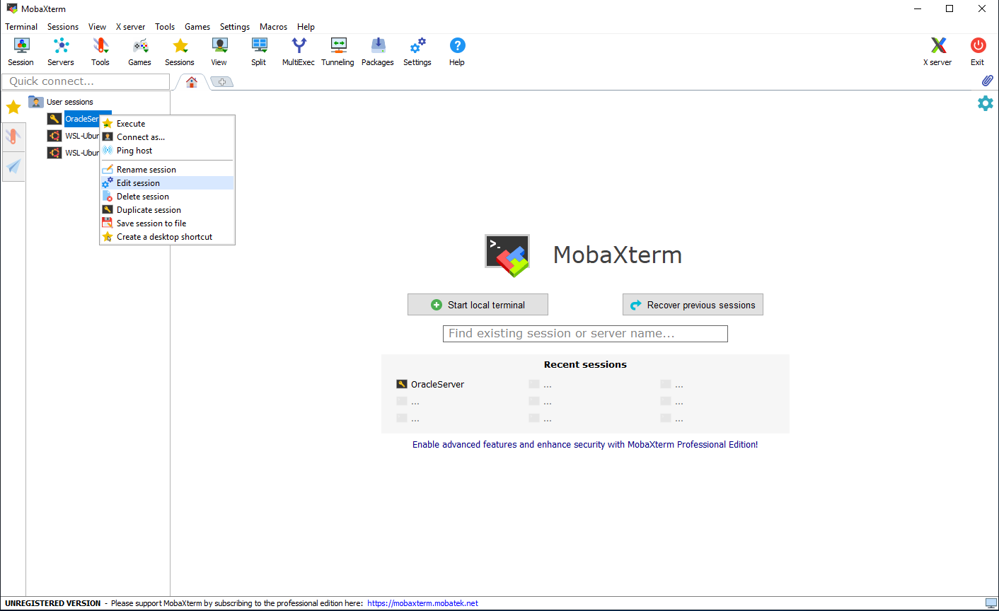
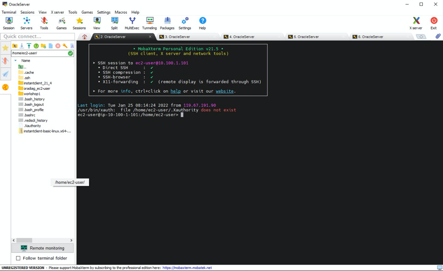

# 키페어 생성

1. AWS Console에 Login 합니다.

2. 서비스 => EC2로 이동

3. 화면 좌측에서 "네트워크 및 보안" => "키 페어" Click

4. "키 페어 생성" Click

5. 이름 : "DBforMSA" 입력 후 "키 페어 생성" Click

6. 자동으로 Private Key인 DBforMSA.cer 혹은 DBforMSA.pem가 개인 Laptop으로 Download됩니다. 

   보안적으로 매우 중요한 파일이기 때문에 안전한 곳에 저장해둡니다.

7. Console에서도 방금 생성된 Key File을 확인합니다.

# 실습 환경 구성

1. CloudFormation 으로 이동

2. "스택 작업" => "새 리소스" 선택

3. "Amazon S3 URL"에 https://shared-kiwony.s3.ap-northeast-2.amazonaws.com/OnPREM4.yml 을 입력 후 "다음" Click

4. "스택 이름"에 "DBforMSA"를 입력, KeyName에 전 Step에서 다운로드 받은 DBforMSA를 선택 후 "다음" Click

5. "AWS CloudFormation에서 사용자 지정 이름으로 IAM 리소스를 생성할 수 있음을 승인합니다"를 체크 후 "스택 생성" Click

6. "이벤트"를 Click하여 CloudFormation Stack이 정상적으로 생성되는지 확인(약 5~10분 소요)

**Stack 생성이 완료되면 "CREATE_COMPLTE"로 표시 됨**

# 실습을 위해 Bastion Host로 접속

### (모든 작업은 Bastion Host를 통해서 이뤄집니다.)

1. CloudFormation => 출력 => IPWindowsPublicIP를 확인

2. "RDP Client"를 사용하여 Bastion 서버에 접속(Windows는 mstsc.exe, MAC은 Microsoft Remote Desktop 사용)

   아직 EC2 인스턴스가 구동 중이라서 접속이 안 될경우 1~2분 후에 다시 접속을 시도합니다.

**Windows Laptop**

**MAC Laptop**

3. Bastion 접속 (Administrator // Octank#1234)

4. 다운로드 받았던 DBforMSA.cer 파일을 개인 Laptop에서 Bastion Server로 복사 합니다.

**MAC Laptop에서 키 파일 복사**

**Windows Laptop에서 키 파일 복사**

**복사한 pem 파일을 Bastion Server의 C:\keys 로 복사합니다.**

5. MobaXterm(SSH Terminal Program)을 실행합니다.

6. "User Sessions"에서 "OracleServer"를 선택 후 "Edit session" 선택

7. Server접속을 위한 pem key 설정
   1. "Advanced SSH Sessting" 선택
   2. "Use private Key" Check
   3. "Key 불러오기" 선택
   4. "C:\keys"로 이동
   5. "DBforMSA.cer"을 선택 후 open
   6. "OK" Click

8. Oracle Server 접속

   **Execute"로 서버 접속**

**Fingerprint Alert Accept Click**

**서버 접속 확인**

# 작업에 필요한 Session 5개를 생성합니다.

1. 작업을 위해 MobaXterm에서 Session을 5개를 만듭니다.

2. Session 5개 Open

3. Session Rename - Oracle, Redis, APP, ApacheBench, extra로 각각 변경

[다음 워크샵으로 - workshop01 ](../workshop01/workshop01.md) 
