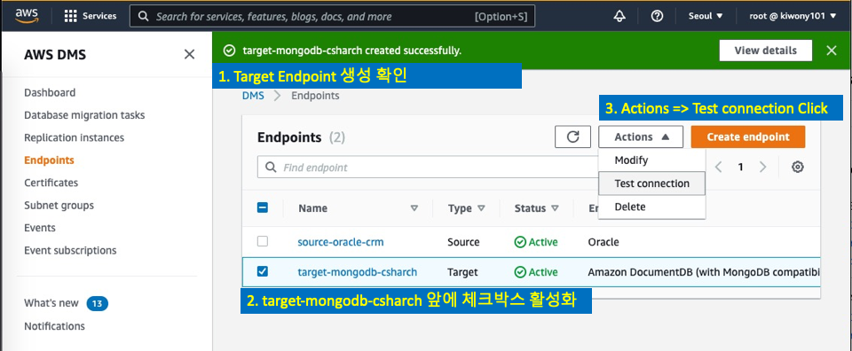
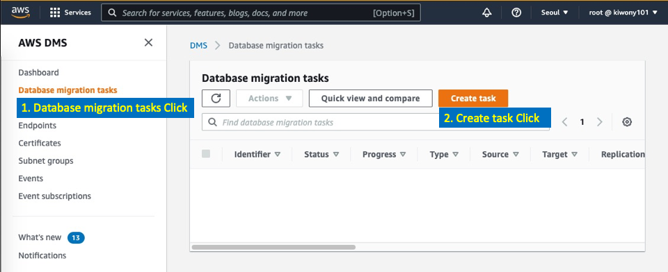

# workshop01

```
당신은 RETAIL 업체에서 일하고 있으며, 개발팀과 DBA를 이끄는 Team Leader입니다.

고객만족팀에서는 기존에 Java와 Oracle로 만들어진 Legacy CRM 시스템을 사용하고 있습니다. 
최근 몇년간 시스템을 이용하면서 데이터가 누적되면서 성능 이슈와 함께 Storage 이슈도 발생하고 있습니다.
또한 새로 입사한 신규 개발자들은 Java보다는 경량화된 Python이나 JS를 개발에 이용하고 싶어합니다. 

당신은 고객만족팀과의 미팅 후에 "CRM - 고객 상담 데이터"중 2019년 이전 Data들은 단순 조회 업무로만 사용됨을 알게 되었습니다.

기존 Legacy Java Application에서는 "고객 상담 데이터"를 보여주기 위해서 여러개의 Table을 Join해야 했고, 
이로 인해서 각 팀에서는 다음과 같은 불만 사항이 있습니다.

1. DBA : Size가 큰 Table간의 다중 Join Report 생성으로 인한 Main Oracle Server 부하 증가
2. 개발자 : 변경/신규 개발을 위한 Schema 변경이 필요하지만, 이로 인한 Main Oracle 영향도 때문에 배포를 특정 PM 시간에만 할 수 있음으로 개발 생산성이 떨어짐

그래서 당신은 2019년 이전 데이터들을 다중 Join RDB Table 구조에서 하나의 Document 형태로 변경하는 아이디어를 떠올렸고, 
이를 통해 Main DB의 부하와 사용량을 줄이고 개발자들이 좀 더 유연하게 개발을 할 수 있지 않을까 생각했습니다.

그러면 기존 RDB에 저장된 복잡한 구조의 Data를 어떻게 NoSQL(MongoDB) Database로 쉽게 이관할 수 있을까요?

```


# 작업에 필요한 Session 5개를 생성합니다.

1. 작업을 위해 MobaXterm에서 Session을 5개를 만듭니다.


2. Session 5개 Open


3. Session Rename - Oracle-HR, AP-TOMCAT, AP-FLASK, MongoDB, Extra로 각각 변경


4. Session 이름 변경 후 확인


# Oracle DB의 JOIN DATA를 MongoDB로 마이그레이션 

1. SQL Developer를 실행합니다.(최초 실행 시 10~20초 정도 소요됩니다.)


---

2. oracle-hr을 선택하고 마우스 우측 버튼을 누른 후 "Connect" 실행


---

3. 바탕 화면의 Query3.txt를 Double Click하여 엽니다.


---

4. Query3.txt의 내용을 모두 복사해서 SQL Developer의 Worksheet에 붙여 넣습니다.


---

5. 1~5번까지의 Query를 직접 수행해서 CRM DB의 Data를 확인합니다. 

```
Query 1 : CUSTOMERS CUSTOEMR_SERVIE_HISTORY Table 의 일부 Data를 확인

Query 2 : CUSTOMERS 와 CUSTOMER_SERVICE_HISTORY Table을 Join한 결과를 확인(고객 상담 LOG Data)
(실제 CRM System에서는 보통 Table이 6~14개까지 Join이 됩니다, 저희는 실습을 위해서 간략화하여 2개 Table만 Join합니다.)

Query 3 : Query2(고객 상담 LOG Data)의 총 갯수를 확인

Query 4 : Query2(고객 상담 LOG Data)의 Data 중 조회용으로만 사용 될 2019년 1월 1일 이전 데이터의 갯수 확인
-- 4286건의 Data를 확인

Query 5 : CUSTOMERS 와 CUSTOMER_SERVICE_HISTORY Table을 Join한 결과 중 2019년 1월 1일 이전 데이터 확인

```

Query 실행은 원하는 SQL문장에 커서를 가져가거나 Highlight한 후 초록색 실행 버튼을 클릭합니다.


6. 이제 Query 5에서 확인한  2019년 이전 Data를 MongoDB로 이관하기 위해서 Materialized View를 생성하겠습니다. 

   Query 6을 실행합니다. 

​       이제 CSHARCH라는 MVIEW가 만들어졌으며, 이후 CSHARCH MVIEW의 DATA를 MongoDB로 이관 할 것입니다.

​       % 2019년 이전 Data뿐 아니라 전체 Data를 이관 할 경우 where 조건에서 call_date 조건절을 제거 하면 모든 데이터를 이관합니다.

```
-- 전환 대상인 2019년 이전 CUSTOMERS+CUSTOMER_SERVICE_HISTORY 데이터들을 MVIEW로 생성합니다. 
-- 실제 DB에서는 보통 6~14개 정도의 Table이 Join되지만, 워크샵에서는 2개의 Table만 Join 합니다.
create MATERIALIZED VIEW CSHARCH
  NOLOGGING
  CACHE
  BUILD IMMEDIATE 
  REFRESH ON DEMAND
  as
  select CSH.csh_id,CUS.CUST_ID, CUS.EMAIL, CUS.PHONE_NUMBER, CUS.ADDRESS, CUS.ROYALTY, CSH.CALL_DATE, CSH.DETAILS 
  from customers CUS, CUSTOMER_SERVICE_HISTORY CSH
  where CUS.cust_id=CSH.cust_id
  and call_date < to_date('2019-01-01','yyyy-mm-dd');
```


7. "Bastion Server"에서 Chrome을 실행하고, 즐겨 찾기에서 CRM-LIST를 Click합니다. (크롬은 TaskBar에 QuickStart로 있습니다.)

아래의 Page처럼 Legacy Java Application이 동작하고 있습니다. 

고객 중에서 1번 'Mary Schaefer'의 고객 상담 내역을 조회해 봅니다. 

"Customer Satisfaction" Page는 Oracle에서 2개의 테이블 CUSTOMERS, CUSTOMER_SERVICE_HISTORY를 JOIN해서 보여줍니다.


8. 이제 "고객 상담 내역" Data 중에서 2019년 1월 1일 이전의 Data를 MongoDB로 Migration 해보겠습니다.

그리고 Legacy Java Appliation 중 crm-show.jsp에 해당하는 '고객 상담 내역 조회' 업무를 Python Flask로 변경하겠습니다. 

**우선 Oracle Data를 MongoDB로 Migration 해보겠습니다.**


9. 사용중인 PC의 AWS Console에서 Database Migration Service로 이동합니다. (Bastion 서버가 아닌 사용자 PC에서 작업!!)

```
이제 여러분은 Database Migration Service을 이용하여 다음 과정을 통해 Oracle To MongoDB로 Data를 이관하게 됩니다.
Data 이관은 크게 아래 3가지 작업을 통해서 이뤄집니다.

1. Replication Instance 생성 : Data 이관 작업을 수행 할 Instance를 생성하는 과정입니다.
2. ENDPOINT 생성
	- Source ENDPOINT 생성 : Legacy Oracle DB를 Source로 사용 할 ENDPOINT를 생성하는 과정입니다.
	- Target ENDPOINT 생성 : 새로운 MongoDB를 Target으로 사용 할 ENDPOINT를 생성하는 과정입니다.
3. DMS TASK 생성 
  - Source Oracle DB의 이관 대상 Schema와 Table을 선택하고, Target MongoDB에 어떤 Collection으로 넣을지 설정합니다.
  - 해당 설정을 토대로 Source to Target으로 Data 이관이 수행됩니다.
```


10. 먼저 Replication Instance(복제 인스턴스)를 생성합니다. 

"Replication Instances"(복제 인스턴스)를 Click합니다.

"Create Replication Instances"(복제 인스턴스 생성)를 Click합니다.


**다음의 화면처럼 "Replication Instance" 정보를 입력합니다. 모두 입력 후 화면 맨 아래 "Create"를 Click합니다.**

```
Name : ri-oracle-to-mongodb
Description : Replication Instance for Migration
Instance class : dms.t3.small 또는 dms.t3.medium 또는 dms.t3.large
Engine Version : 3.4.6
Allocated Storage : 50
VPC : OnPREM
Multi AZ : Dev
Publicly accessible : 체크 안함
```


**ri-oracle-to-mongodb가 Available(사용 가능) Status로 정상 생성될때까지 기다립니다.(약 5분 소요)**


11. Oracle DB를 읽어 올 Source Endpoint를 생성합니다.

화면 왼쪽 메뉴에서 "Endpoints"(엔드포인트)를 클립합니다. "Create endpoint"(엔드포인트 생성)을 클릭합니다. 


**다음의 화면처럼 "Endpoint" 정보를 입력합니다. 모두 입력 후 화면 맨 아래 "Create endpoint"를 Click합니다.**

```
Endpoint Type(엔드포인트 유형) : Source endpoint(소스 엔드포인트)

Endpoint Identifier : source-oracle-crm
Source Engine : Oracle

Access to endpoint database : Provide access information manually(수동으로 액세스 정보 제공)
Server Name : 10.100.1.101
Port : 1521
User name : dms
Password : dms
SID/Service name : XE

% Database Migration Service를 사용하기 위해서는 사전에 Source DB에서 해줘야 하는 선행 작업들이 존재합니다.
% Data Access를 위한 권한 설정과 CDC를 위한 권한 설정등입니다. 이번 워크샵에서는 해당 작업들을 사전에 해두었습니다.
% 좀 더 자세한 내용은 https://docs.aws.amazon.com/dms/latest/userguide/CHAP_Source.Oracle.html을 보시거나
% 바탕화면의 Query.txt의 2번째 "SQL Developer를 이용하여 OnPREM Oracle 선행 작업"을 보시면 됩니다.

```


**생성된 Source Endpoint와 "Replication Instance - ri-oracle-to-mongodb" 간의 connection을 확인**


12. Target이 되는 MongoDB용 Target Endpoint를 생성합니다.


**다음의 화면처럼 "Endpoint" 정보를 입력합니다. 모두 입력 후 화면 맨 아래 "Create endpoint"를 Click합니다.**

```
Endpoint Type(엔드포인트 유형) : Target endpoint(대상 엔드포인트)

Endpoint Identifier : target-mongodb-csharch
Target Engine : Amazon DocumentDB (with MongoDB compatibility)

Access to endpoint database : Provide access information manually(수동으로 액세스 정보 제공)
Server Name : 10.100.1.101
Port : 27017
User name : myadmin
Password : Welcome1234
Database Name : crm

% Workshop에서는 편의를 위해서 같은 서버에 설치된 MongoDB를 사용하고 있습니다. 실제 환경에서는 다른 서버에 설치된 MongoDB를 사용 할 수 있습니다.
% Workshop같은 개발 환경에서는 설치형 Standalone을 사용하고, 실제 PROD환경에서는 HA, Security, Backup, 운영등을 위해서
% Amazon DocumentDB나 MongoDB Atlas를 사용하시는 것이 좋습니다. 
```


**생성된 Target Endpoint와 "Replication Instance - ri-oracle-to-mongodb" 간의 connection을 확인**




---

13. Source Oracle Data를 Target MongoDB로 전환 시킬 DMS Task를 생성합니다.

"Database migration tasks(데이터베이스 마이그레이션 태스크)"를 Click 합니다. "Create task(태스크 생성)"를 Click 합니다.



**다음의 화면처럼 "Task" 정보를 입력합니다. 모두 입력 후 화면 맨 아래 "Create task"를 Click합니다.**

**Task configuration**

```
Task identifier : oracle-csharch-to-mongodb
Replication instance : ri-oracle-to-mongodb
Source database endpoint : source-oracle-crm
Target database endpoint : target-mongodb-csharch
Migration type : Migrate existing data(기존 데이터 마이그레이션)

```

**Task setting**

```
Target table preparation modeInfo : Drop tables on target(대상에서 테이블 삭제)
Include LOB columns in replication : Limited LOB mode (제한적 LOB 모드)
Enable CloudWatch logs(CloudWatch 로그 활성화) : 체크 활성화
```

**Table mappings**(테이블 매핑)

```
"Add new selection rule(새 선택 규칙 추가)" Click

Schema : Enter a schema(스키마를 입력하십시요)
Schema name : HR
Table name : CSHARCH
Action : include(포함)

```

**Migration task startup configuration(마이그레이션 태스크 시작 구성)**

```
Start migration task : Manually later(나중에 수동으로)
```


**Task Status가 "Ready(준비)"가 될때까지 기다립니다.**


**Task를 실행합니다. Actions=>Restart/Resume(작업=>재시작/재개)**


**Task Identifier : oracle-csh-to-mongodb Click을 Click하여 DMS TASK의 Migration 상황을 모니터링 합니다.**


**Table statiscis Tab을 눌러서 데이터 이관을 확인합니다, 조금 기다리면 대상 Data  4286건이 정상적으로 이관되었음을 확인합니다.**


14. 실제로 Target MongoDB에 접속하여 데이터 이관이 되었는지 확인합니다. 원격 터미널을 이용하여 Bastion Server로 접속합니다.

15. MobaXterm에서 MongoDB Session으로 이동합니다.

16. 아래처럼 입력하여 mongodb로 접속 하고, Data 건수를 확인합니다.

    CSHARCH collection의 document 숫자가 4286임을 확인합니다.

    Data 중에서 CALL_DATE가 가장 오래된것 과 최신 것을 확인합니다. 

    의도한대로 2019년 1월 1일 이전의 Data들만이 MongoDB로 이관 된 것을 확인 할 수 있습니다. 

```
ec2-user@ip-10-100-1-101:/home/ec2-user> mongoadmin
MongoDB shell version v4.4.12
connecting to: mongodb://127.0.0.1:27017/?authSource=admin&compressors=disabled&gssapiServiceName=mongodb
Implicit session: session { "id" : UUID("7904e03b-796a-4698-a088-cbc4d901ccd3") }
MongoDB server version: 4.4.12
> use crm
switched to db crm
> show collections
CSHARCH
> db.CSHARCH.find().count()
4286
> db.CSHARCH.find({},{CUST_ID:1,EMAIL:1,CALL_DATE:1}).sort({CALL_DATE:+1}).limit(1)
{ "_id" : ObjectId("620c930a0e83f26aca4a85e7"), "CUST_ID" : "8424", "EMAIL" : "KevinClayton@vance.com", "CALL_DATE" : ISODate("2016-08-19T14:21:58Z") }
> db.CSHARCH.find({},{CUST_ID:1,EMAIL:1,CALL_DATE:1}).sort({CALL_DATE:-1}).limit(1)
{ "_id" : ObjectId("620c930a0e83f26aca4a8461"), "CUST_ID" : "7850", "EMAIL" : "JasonRobinson@taylor-jennings.com", "CALL_DATE" : ISODate("2018-12-31T14:21:56Z") }
>


% 참고
ec2-user@ip-10-100-1-101:/home/ec2-user> alias |grep mongoadmin
alias mongoadmin='mongo -u myadmin -p Welcome1234   --authenticationDatabase "admin"'
```


17. 이제 Data이관이 완료되었습니다. 이제 Legacy Java Application에서 경량화된 Python Flask Application으로 바꿔보겠습니다.

MobaXterm에서 AP-FLASK Session으로 이동합니다. 

18. 다음의 명령어를 실행하여 Flask Application을 실행합니다.

```
ec2-user@ip-10-100-1-101:/home/ec2-user> cd workshop01
ec2-user@ip-10-100-1-101:/home/ec2-user/workshop01> source bin/activate
(workshop11) ec2-user@ip-10-100-1-101:/home/ec2-user/workshop11> flask run --host=0.0.0.0
 * Environment: production
   WARNING: This is a development server. Do not use it in a production deployment.
   Use a production WSGI server instead.
 * Debug mode: off
 * Running on all addresses.
   WARNING: This is a development server. Do not use it in a production deployment.
 * Running on http://10.100.1.101:5000/ (Press CTRL+C to quit)

```


19. Chrome을 실행하고 즐겨 찾기에서 FLASK-1을 Click합니다. Python FLASK App에서 사용자별 상담 내역을 확인 할 수 있습니다. 

FLASK-1은 고객 중에서 1번 'Mary Schaefer'의 고객 상담 내역을 조회하는 Page입니다.

Backend FLASK => MongoDB => FLASK => Rendring HTML (추후 아키텍처 추가)


20. FLASK-4를 눌러서 4번 고객의 상담 내역을 확인합니다.


21. MobaXTerm으로 돌아와서 ctrl+c 를 눌러서 Flask App을 종료합니다.

22. 다음처럼 실행하여 Flask Application을 확인합니다.

    


**Source Code는 다음과 같습니다. Parameter로 넘어온 고객번호를 이용하여 FLASK가 MongoDB의 Data를 가져오고 결과를 사용자에게 보여줍니다.**

```
import sys
import time
import json
from flask import Flask, request, render_template
from pymongo import MongoClient
from bson.objectid import ObjectId
import urllib.parse
from bson import json_util
from flask import jsonify
from datetime import date
from bson.json_util import loads
from bson.json_util import dumps

## Connection String for MongoDB, credential hard coding is high risky.
## This is only for workshop, MUST use AWS SECRET MANAGER to PROTEST YOUR SYSTEM
username = urllib.parse.quote_plus('myadmin')
password = urllib.parse.quote_plus('Welcome1234')
client = MongoClient('mongodb://%s:%s@10.100.1.101' % (username, password))

db = client.crm
collection = db.CSHARCH

app = Flask(__name__, static_url_path='')
@app.route('/', methods=['GET'])
def index():
     return 'This is index page'
@app.route('/select', methods=['GET'])
def select():
    paramCustID = request.args.get("CUST_ID")
    docs = list(collection.find({"CUST_ID" : paramCustID},{"_id":0,"CUST_ID": 1,"EMAIL": 1, "PHONE_NUMBER": 1, "ROYALTY": 1, "CALL_DATE": 1,"DETAILS" :1}))

    return render_template(
                'ShowDetails.html',
                pCustID=docs[0]['CUST_ID'],
                pEmail=docs[0]['EMAIL'],
                pPhoneNumber=docs[0]['PHONE_NUMBER'],
                pRoyalty=docs[0]['ROYALTY'],
                pCallDate=docs[0]['CALL_DATE'],
                #pDetails=docs[0]['DETAILS']
                pDetails=docs[0]['DETAILS'].replace("\\n","<BR><BR>")
            )

if __name__ == '__main__':
 if len(sys.argv) > 1:
     app.debug = True
     app.jinja_env.auto_reload = True
     app.config['TEMPLATES_AUTO_RELOAD'] = True
     app.run(host='0.0.0.0', port=4000)
 else:
     #select();
     app.run(host='0.0.0.0')

```

[다음 워크샵으로 - workshop02 ](../workshop02/workshop02.md) 


