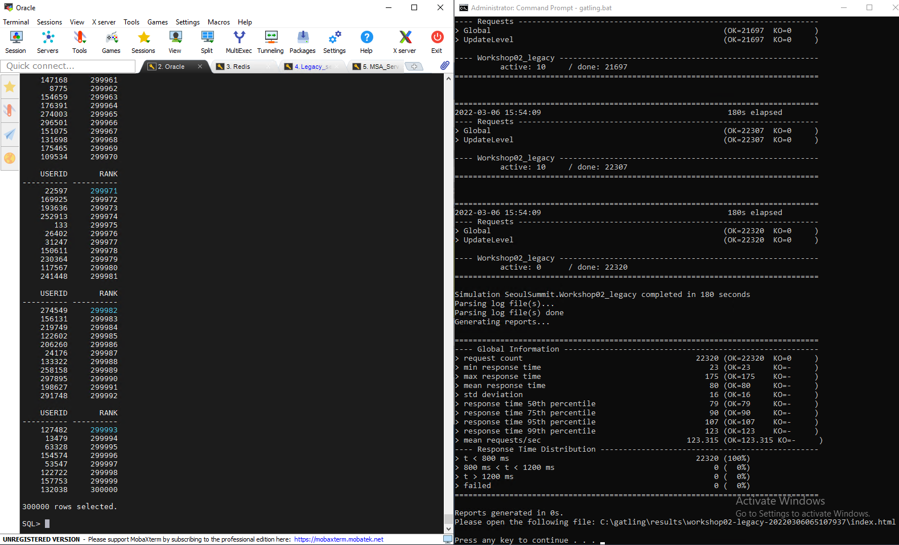
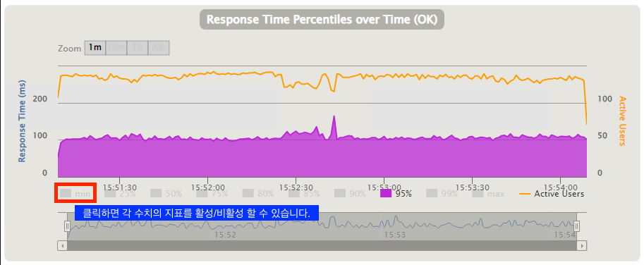
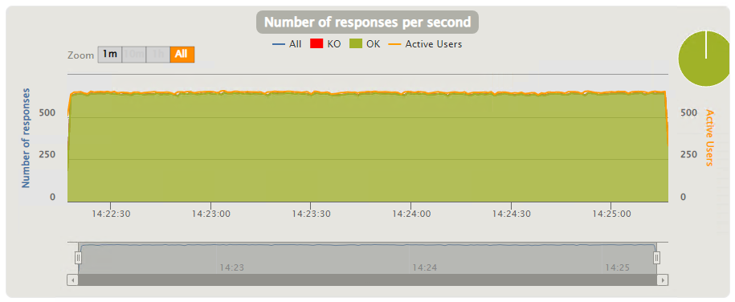

# Workshop02(Redis를 활용한 실시간 리더보드 만들기)


_엔터프라이즈 모놀리틱 DB를 MSA 구조로 전환하기_ 세션의 Workshop2에 오신 것을 환영합니다.
Workshop2 에서는 리더보드 데이터를 Oracle에서 Redis로 마이그레이션해보고, Redis에서 실시간 리더보드가 어떻게 구현되는지 실습을 통해 알아보겠습니다.

---

### Architecture Diagram


---

### 시나리오 소개
```
당신은 Gaming 업체에서 일하고 있으며, 사용자의 레벨과 경험치를 기준으로 Leaderboard를 제공하는 서비스를 담당하고 있습니다.

Leaderboard 서비스의 데이터 저장소로 Oracle을 사용하고 있고,
Leaderboard 데이터 생성으로 인한 시스템 자원 사용률 증가가 게임 서비스의 지연을 발생시킨다는 것을 알고 있습니다.

그래서 별도의 Leaderboard용 Oracle DB를 구성하여 그곳에서 Leaderboard 데이터를 생성하고, 
그 결과를 다시 Main Oracle DB서버로 복사하는 아키텍처를 구성하여 사용하고 있습니다. 

하지만 서비스의 사용자수가 점점 증가함에 따라 Leaderboard 데이터 생성과 데이터 복사에 점점 많은 시간이 소요되고 있으며,
또한 고객들은 배치 인터벌이 있는 Leaderboard 서비스가 아닌 실시간 Leaderboard에 대해 요구하고 있습니다.

이런 문제를 해결하기 위해서 Leaderboard 데이터 저장소를 In-Memory DB로 변경하는 아이디어를 떠올렸고,
이를 통해 Main DB의 부하도 줄이면서 실시간 Leaderboard 서비스를 제공 할 수 있지 않을가 생각했습니다.

그러면 기존 Leaderboard 서비스 Data를 어떻게 In-Memory DB로 변경/전환 할 수 있을까요?
```
---

# 작업에 필요한 MobaXterm Session 4개를 생성합니다.

1. Session을 생성하는 방법은 Workshop01의 Session 생성 단계를 참고 합니다.
2. Session의 이름을 각각 `Oracle`,`Redis`,`Legacy_server`, `MSA_server` 으로 변경합니다.


---

# Oracle의 Leaderboard 데이터를 Redis로 마이그레이션 합니다.

1. MobaXterm의 Oracle session으로 이동하여 sqlplus로 Oracle DB에 접속 후 `rank()`를 사용하여 leaderboard 데이터를 조회해 봅니다.   
USERLEVEL과 EXPOINT 기준으로 정렬된 30만건의 데이터가 표시됩니다.
```
ec2-user@ip-10-100-1-101:/home/ec2-user> sudo su -
Last login: Tue Feb  8 06:07:37 UTC 2022 on pts/0
root@ip-10-100-1-101:/root# su - oracle
Last login: Tue Feb  8 06:07:44 UTC 2022 on pts/0
oracle@ip-10-100-1-101:/home/oracle> sqlplus oshop/oshop

SQL*Plus: Release 11.2.0.2.0 Production on Tue Feb 8 06:12:37 2022

Copyright (c) 1982, 2011, Oracle.  All rights reserved.


Connected to:
Oracle Database 11g Express Edition Release 11.2.0.2.0 - 64bit Production

SQL> SELECT userid, rank() OVER (ORDER BY USERLEVEL DESC, EXPOINT DESC) AS rank FROM USER_SCORE;
...
    USERID       RANK
---------- ----------
    260091     299982
      6205     299983
    192037     299984
    220661     299985
    144834     299986
    110780     299987
      6474     299988
    128521     299989
    231474     299990
    110140     299991
     52016     299992

    USERID       RANK
---------- ----------
    162246     299993
    187240     299994
    188193     299995
    225220     299996
    152497     299997
    117736     299998
     86425     299999
    245984     300000

300000 rows selected.

SQL>
```
---

2. Redis로 데이터를 마이그레이션 하는데 필요한 스테이징 테이블과 데이터를 만듭니다.   
    sqlplus에 아래 쿼리를 붙여넣고 엔터를 입력합니다.

```
CREATE TABLE "OSHOP"."USER_SCORE_REDIS_FORMAT" 
   (	"key" VARCHAR2(15), 
	"score" NUMBER, 
	"member" NUMBER, 
	 CONSTRAINT "USER_SCORE_REDIS_FORMAT_PK" PRIMARY KEY ("member"));

INSERT INTO USER_SCORE_REDIS_FORMAT
SELECT 'leaderboard' AS key,  
	userlevel||LPAD(expoint, 13, '0') AS score,
	USERID AS MEMBER
FROM USER_SCORE us;

commit;
```

[참고] 쿼리를 붙혀넣기하면 아래와 같은 팝업이 뜨는데 그냥 OK 클릭하시면 됩니다.


쿼리 수행이 정상적으로 완료되면 아래와 같이 화면에 표시됩니다.


---

3. 스테이징 테이블을 CSV파일로 저장합니다.   
    MobaXterm에서 `MSA_Server` 세션으로 이동하여 아래 명령어를 수행합니다.

~~~
ec2-user@ip-10-100-1-101:/home/ec2-user> cd workshop02/msa
ec2-user@ip-10-100-1-101:/home/ec2-user/workshop02/msa> sudo su -
Last login: Sun Mar  6 03:28:55 UTC 2022 on pts/3
root@ip-10-100-1-101:/root# su - oracle
Last login: Sun Mar  6 03:28:58 UTC 2022 on pts/3
oracle@ip-10-100-1-101:/home/oracle> cd workshop02
oracle@ip-10-100-1-101:/home/oracle/workshop02> sh 01-unload-data.sh
oracle@ip-10-100-1-101:/home/oracle/workshop02> ls
01-unload-data.sh  unload_user_score.sql  user_score.csv
oracle@ip-10-100-1-101:/home/oracle/workshop02> tail user_score.csv
leaderboard,     941645071728030,                              296488
leaderboard,     931645071728030,                              296489
leaderboard,     251645071728030,                              296490
leaderboard,     121645071728030,                              296491
leaderboard,     151645071728030,                              296492
leaderboard,     961645071728030,                              296493
leaderboard,     771645071728030,                              296494
leaderboard,     601645071728030,                              296495
leaderboard,     91645071728030,                               296496
leaderboard,     211645071728030,                              296497
~~~
---

4. user_score.csv 파일을 Redis서버로 마이그레이션 합니다.   
    `MSA_Server session`에서 아래 명령을 이어서 실행압니다.

~~~
oracle@ip-10-100-1-101:/home/oracle/workshop02> exit
logout
root@ip-10-100-1-101:/root# exit
logout
ec2-user@ip-10-100-1-101:/home/ec2-user/workshop02/msa> sh 01-copy-score.sh
ec2-user@ip-10-100-1-101:/home/ec2-user/workshop02/msa> sh 02-transform.sh
ec2-user@ip-10-100-1-101:/home/ec2-user/workshop02/msa> sh 03-load-data-to-redis.sh
Warning: Using a password with '-a' or '-u' option on the command line interface may not be safe.
All data transferred. Waiting for the last reply...
Last reply received from server.
errors: 0, replies: 300000
~~~
```

## shell script command 내용 및 설명
### unload한 data를 ec2-user directory 이동 및 ownership을 변경
ec2-user@ip-10-100-1-101:/home/ec2-user/workshop02/msa> cat 01-copy-score.sh
sudo cp /home/oracle/workshop02/user_score.csv /home/ec2-user/workshop02/msa/user_score.csv
sudo chown ec2-user:ec2-user /home/ec2-user/workshop02/msa/user_score.csv

### raw data를 REDIS Insert 용 command로 변경
ec2-user@ip-10-100-1-101:/home/ec2-user/workshop02/msa> cat 02-transform.sh
awk -F "," 'NR > 0{ print "ZADD "$1" "$2" "$3}' ./user_score.csv > redis-load.cmd

### redis-cli를 사용하여 data를 loading
ec2-user@ip-10-100-1-101:/home/ec2-user/workshop02/msa> cat 03-load-data-to-redis.sh
cat redis-load.cmd | redis-cli -a Welcome1234 --pipe


```


---

5. Redis에 접속하여 마이그레이션된 데이터를 확인합니다.   
    zcard leaderboard : leaderboard key에 속한 멤버 개수를 리턴   
    zrevrange leaderboard 0 9 : score가 큰 순서대로 10개(0~9)의 멤버를 리턴

~~~
ec2-user@ip-10-100-1-101:/home/ec2-user/workshop02/msa> redis-cli -a Welcome1234
Warning: Using a password with '-a' or '-u' option on the command line interface may not be safe.
127.0.0.1:6379> zcard leaderboard
(integer) 300000
127.0.0.1:6379> zrevrange leaderboard 0 9
 1) "299830"
 2) "299827"
 3) "299472"
 4) "299265"
 5) "299209"
 6) "298755"
 7) "298525"
 8) "298502"
 9) "298233"
10) "298162"
127.0.0.1:6379> zrevrank leaderboard 299830
(integer) 0
127.0.0.1:6379> exit
ec2-user@ip-10-100-1-101:/home/ec2-user/workshop02/msa>
~~~
---

# Oracle에서 leaderboard 조회 쿼리 영향도 확인

1. Oracle database를 데이터 저장소로 사용하고 있는 Leaderboard Application을 구동합니다.  
MobaXterm에서 Legacy_server tab으로 이동하여 아래 명령어를 수행합니다.
```
ec2-user@ip-10-100-1-101:/home/ec2-user> cd workshop02/legacy
ec2-user@ip-10-100-1-101:/home/ec2-user/workshop02/legacy> source bin/activate
(legacy) ec2-user@ip-10-100-1-101:/home/ec2-user/workshop02/legacy> flask run --host=0.0.0.0 --port=4000
 * Environment: production
   WARNING: This is a development server. Do not use it in a production deployment.
   Use a production WSGI server instead.
 * Debug mode: off
 * Running on all addresses.
   WARNING: This is a development server. Do not use it in a production deployment.
 * Running on http://10.100.1.101:4000/ (Press CTRL+C to quit)
```

---

2. Oracle database의 Real time leaderboard 구성에 대한 영향도를 확인해 봅니다.  
    [Gatling](https://gatling.io/)을 사용하여 여러 유저들의 Level을 변경하는 요청을 보내고, 요청이 수행되는 동안 Oracle rank함수를 사용하여 ranking 데이터를 조회해 봅니다.
    부하 주입은 Bastion Server에서 실행하게 됩니다.  
    Bastion Server의 Taskbar에서 아래 아이콘을 클릭하여 Command Prompt 윈도우를 실행합니다.
    

Command Prompt에서 아래 명령를 차례로 입력합니다.  
부하 주입 시간은 3분으로 설정되어 있습니다.

```
C:\Users\Administrator> CD C:\gatling\bin
C:\gatling\bin> gatling.bat
GATLING_HOME is set to "C:\gatling"
JAVA = "java"
Choose a simulation number:
     [0] SeoulSummit.Workshop02_legacy
     [1] SeoulSummit.Workshop02_msa
     [2] SeoulSummit.Workshop04_legacy
     [3] SeoulSummit.Workshop04_msa
0(0번 시나리오를 수행합니다.)
Select run description (optional)
(엔터를 한번 더 입력합니다.)
Simulation SeoulSummit.Workshop2_legacy started...

================================================================================
2022-03-06 15:51:14                                           5s elapsed
---- Requests ------------------------------------------------------------------
> Global                                                   (OK=601    KO=0     )
> UpdateLevel                                              (OK=601    KO=0     )

---- Workshop02_legacy ---------------------------------------------------------
          active: 9      / done: 601
================================================================================
```
Level update 요청이 수행되는 동안 Oracle에 접속하여 rank 함수를 호출하여 ranking data를 조회합니다.   
MobaXterm의 Oracle session에서 아래 명령을 수행합니다.
``` sql
# 아래 쿼리는 Oracle에서 USER_SCORE 테이블의 전체 데이터의 ranking을 구하는 쿼리입니다.
# 이 쿼리를 수행하여 별도의 ranking 테이블을 만들고 그 테이블을 조회하여 top 10 ranker나 유저의 ranking을 찾을 수 있습니다.
SQL> SELECT userid, rank() OVER (ORDER BY USERLEVEL DESC, EXPOINT DESC) AS rank FROM USER_SCORE;
```
   
부하가 끝나면 아래와 같이 통계정보를 확인할 수 있습니다.
   
Gatling은 웹기반의 보고서를 제공합니다. 부하가 끝난 후 제공되는 html 링크(위 그림에서 빨간색 박스)를 웹브라우저를 사용하여 열어봅니다.   
Ranking 조회 쿼리가 수행된 구간에서 p95의 Response Time이 상승하고 요청 처리량이 감소하는 그래프를 볼 수 있습니다.   
데이터가 많을 경우 Leaderboard를 조회하는 쿼리가 많은 리소스를 사용하게 되고 이로 인해 사용자 요청에 지연이 발생할 수 있기 때문에 이런 쿼리를 자주 수행하며 Leaderboard 데이터를 최신화하는 것은 부담스러운 작업입니다.   




MobaXterm의 Legacy_server 세션으로 이동하여 CTRL+C 를 눌러 어플리케이션을 종료합니다.
```
10.100.1.103 - - [08/Feb/2022 06:28:07] "GET /legacy/updateuserlevel HTTP/1.1" 200 -
^C(legacy) ec2-user@ip-10-100-1-101:/home/ec2-user/workshop2/legacy>
```
---

# Redis에서 실시간 Leaderboard 서비스를 테스트

1. MobaXterm의 MSA_server 세션으로 이동하여 Redis를 데이터 스토어로 사용하는 Leaderboard 서비스를 실행합니다.
```
ec2-user@ip-10-100-1-101:/home/ec2-user/workshop02/msa> source bin/activate
(msa) ec2-user@ip-10-100-1-101:/home/ec2-user/workshop02/msa> flask run --host=0.0.0.0 --port=4000
 * Environment: production
   WARNING: This is a development server. Do not use it in a production deployment.
   Use a production WSGI server instead.
 * Debug mode: off
 * Running on all addresses.
   WARNING: This is a development server. Do not use it in a production deployment.
 * Running on http://10.100.1.101:4000/ (Press CTRL+C to quit)
```
---

2. Legacy와 동일하게 Gatling을 활용하여 Leaderboard의 Level을 업데이트하면서 ranking을 조회해보고 영향도를 확인합니다.   
    사용자의 Level이 계속 변경되기 때문에 사용자의 순위도 실시간으로 계속 변경됩니다.
    Bastion Server의 Taskbar에서 아래 아이콘을 클릭하여 Command Prompt 윈도우를 실행합니다.
       

```
C:\Users\Administrator> CD C:\gatling\bin
C:\gatling\bin> gatling.bat
GATLING_HOME is set to "C:\gatling"
JAVA = "java"
Choose a simulation number:
     [0] SeoulSummit.Workshop02_legacy
     [1] SeoulSummit.Workshop02_msa
     [2] SeoulSummit.Workshop04_legacy
     [3] SeoulSummit.Workshop04_msa
1(1번 시나리오를 수행합니다.)
Select run description (optional)
(엔터를 한번 더 입력합니다.)
Simulation SeoulSummit.Workshop2_legacy started...

================================================================================
2022-03-06 14:22:22                                           5s elapsed
---- Requests ------------------------------------------------------------------
> Global                                                   (OK=3034   KO=0     )
> UpdateLevel                                              (OK=3034   KO=0     )

---- Workshop02_msa ------------------------------------------------------------
          active: 10     / done: 3034
================================================================================
```
---

3. Leaderboard 데이터 변경 요청을 주입하는 동안 Redis에서 ranking 조회를 해봅니다.   
    MobaXterm 에서 Redis 탭으로 이동하여 아래 명령을 수행합니다.   
    zrevrange leaderboard 10000 10010 명령어는 랭킹 10000 ~ 10010 사이의 유저를 표시해 줍니다.   
    사용자의 Level 값이 업데이트 되면서 ranking이 계속 바뀌고, "zrevrange leaderboard" 명령어를 활용하여 실시간으로 순위 정보를 확인할 수 있습니다.   
    Redis의 sorted set을 사용하면 데이터의 입력이나 변경시점에 이미 정렬이 되기 때문에 별도의 정렬작업이 필요없고 실시간 leaderboard 조회가 가능합니다.

```
ec2-user@ip-10-100-1-101:/home/ec2-user/workshop02/msa> redis-cli -a Welcome1234
127.0.0.1:6379> zrevrange leaderboard 10000 10010
 1) "25408"
 2) "144669"
 3) "91035"
 4) "43661"
 5) "158444"
 6) "92597"
 7) "144895"
 8) "142565"
 9) "962"
10) "56587"
11) "18594"
127.0.0.1:6379> zrevrange leaderboard 10000 10010
 1) "78525"
 2) "36589"
 3) "74403"
 4) "184208"
 5) "155603"
 6) "65338"
 7) "277657"
 8) "209997"
 9) "29455"
10) "20594"
11) "81012"
```
---

4. 부하 종료 후 통계 데이터를 확인합니다.   
    메모리에서 데이터 변경 처리가 일어나기 때문에 데이터 변경 처리량이 Oracle보다 높은 것을 확인할 수 있습니다.   
    

---

  

5. 웹기반의 보고서를 확인하기 위해 위의 링크를 웹브라우저로 열어봅니다.   
    평균 응답속도가 95%의 평균 응답속도가 20ms을 유지하며 ranking을 조회하더라도 초당 처리량은 변화가 없는 것을 확인할 수 있습니다.
    
    
    

MobaXterm의 MSA_server 세션으로 이동하여 CTRL+C 를 눌러 어플리케이션을 종료합니다.
```
10.100.1.103 - - [07/Apr/2022 13:00:38] "GET /msa/updateuserlevel HTTP/1.1" 200 -
^C(msa) ec2-user@ip-10-100-1-101:/home/ec2-user/workshop02/msa> 
```

```
이제 여러분은 Leaderboard 서비스를 Oracle에서 Redis로 마이그레이션을 완료하였습니다.

Oracle은 초당 123건 update, Redis는 초당 631건 update를 수행하여 전환 후 약 5배의 성능이 향상되었습니다.

또 고객의 요구 사항인 실시간 리더보드 서비스를 제공할 수 있게 되었고, 리더보드 데이터를 만들기 위해서 별도로 구성해야 했던 시스템을 제거하여 
비용을 절감하고 시스템 운영 부담을 줄일 수 있게 되었습니다.
```
------------
```
% Workshop에서는 실습 비용을 줄이기 위해서 EC2에 REDIS를 설치해서 실습을 진행하였습니다.
% 간단한 개발 환경의 경우 EC2 위에서 Standard Alone 방식으로 개발을 진행하고, 
% 실제 운영 환경에서는 뛰어난 가용성과 성능, 백업 기능등을 관리형 서비스인 ElastiCache for REDIS 를 고려하실 수 있습니다.
```

---

[다음 워크샵으로 - workshop03(Redis를 활용하여 한정판매 이벤트 처리하기)](../workshop03/workshop03.md) 

