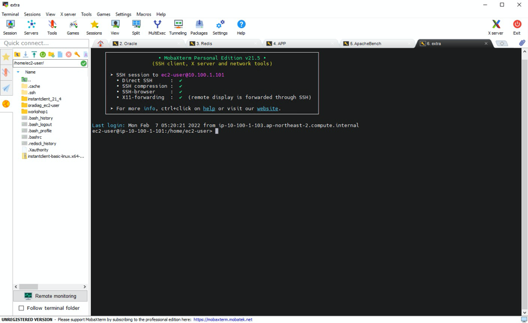
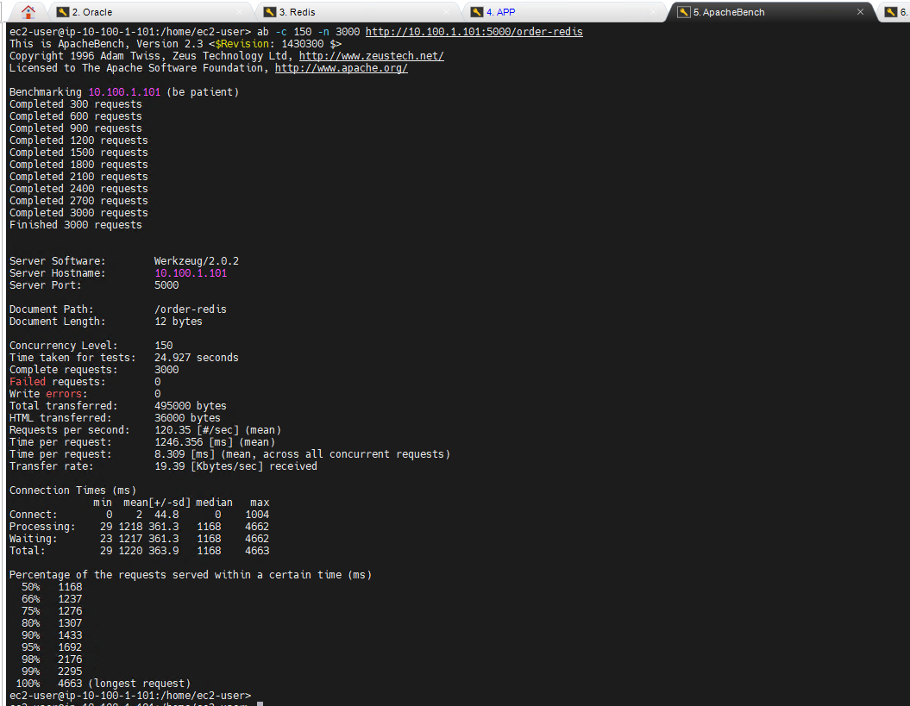

# Workshop03(Redis를 활용하여 한정판매 이벤트 처리하기)

**엔터프라이즈 모놀리틱 DB를 MSA 구조로 전환하기 세션의 Workshop3에 오신 것을 환영합니다.**

**Workshop3 에서는 한정판매 서비스의 Repoistory를 Oracle에서 Redis로 마이그레이션해보고, 한정 판매 이벤트에서 REDIS를 어떻게 효율적으로 사용 할 수 있는지 실습을 통해 알아보겠습니다.**

---

Architecture Diagram


---

**시나리오 소개**

```
당신은 Game을 개발하는 회사의 개발자 혹은 DBA입니다. 

현재 Game(World) Server를 포함한 Login, Manager, Log, SHOP, Auction의 기능들은 하나의 RDBMS(Oracle)을 사용하고 있습니다.
당신의 Game은 예상 이상의 놀라운 인기를 얻고 있으며, 이에 따라 Game APP Server와 Game DB Server는 큰 부하가 생기고 있습니다. 

최근 예정되었던 한정 수량 아이템 이벤트에 수 많은 사용자들이 모여들었고, 이로 인해 Main DB의 성능 저하가 발생하였습니다.
인기가 높았던 만큼 사용자들의 불만도 폭증하였고, 당신은 예정되어 있는 두번째 한정 수량 아이템 이벤트 전에 이 문제를 해결해야 합니다.
DB팀과 문제의 원인을 확인한 결과 Oracle DB의 HOT Block에 의한 성능 저하임을 확인하였습니다.

RDBMS을 사용할 경우 특정 DB Block에 동시에 Access가 발생 할 경우 Hot Block이 발생 할 수 있으며,
이러한 문제는 Game내 Item Event뿐 아니라, 통신사 Billing System, Retail Order System등에서 자주 발생 합니다.
이러한 문제를 해결 하기 위하여 Hash-partitioned reverse-index를 이용하는 방법도 있긴 하지만, 해결이 어려운 경우도 있습니다.

이 문제를 해결하기 위하여 당신은 당신의 개발팀과 DBA들과 이야기를 나누었고, HOT Block을 유발하는 부분을 In-Memory DB로 변경하기로 하였습니다. 
```

---

1. 작업을 위해 MobaXterm에서 Session을 5개를 만듭니다.


---

2. Session 5개 Open


---

3. Session Rename - `Oracle`,` Redis`, `APP`, `ApacheBench`, `extra`로 각각 변경




---

4. MobaXterm  `Oracle` Session에서 DB에 접속하여 Data 초기화 수행

```
ec2-user@ip-10-100-1-101:/home/ec2-user> sudo su -
Last login: Tue Jan 25 08:14:31 UTC 2022 on pts/1
root@ip-10-100-1-101:/root# su - oracle
Last login: Mon Feb  7 04:55:48 UTC 2022
oracle@ip-10-100-1-101:/home/oracle> sqlplus oshop/oshop

SQL*Plus: Release 11.2.0.2.0 Production on Mon Feb 7 05:26:23 2022
Copyright (c) 1982, 2011, Oracle.  All rights reserved.

Connected to:
Oracle Database 11g Express Edition Release 11.2.0.2.0 - 64bit Production

SQL> @purge
1000 rows updated.
Commit complete.
Table truncated.
SQL> 

```


---

5. MobaXterm  `Redis` Session에 접속하여 Data 초기화 수행

```
ec2-user@ip-10-100-1-101:/home/ec2-user> redis-cli
127.0.0.1:6379> auth Welcome1234
OK
127.0.0.1:6379> set prod-001-quantity 3000
OK
127.0.0.1:6379> get prod-001-quantity
"10000"
127.0.0.1:6379>

```


---

6. MobaXterm `APP` Session에서 Oracle을 Repository로 사용하고 있는 Legacy Game Application을 구동합니다.

```
ec2-user@ip-10-100-1-101:/home/ec2-user> cd workshop03/legacy
ec2-user@ip-10-100-1-101:/home/ec2-user/workshop03/legacy> source bin/activate
(legacy) ec2-user@ip-10-100-1-101:/home/ec2-user/workshop03/legacy> flask run --host=0.0.0.0
 * Environment: production
   WARNING: This is a development server. Do not use it in a production deployment.
   Use a production WSGI server instead.
 * Debug mode: off
 * Running on all addresses.
   WARNING: This is a development server. Do not use it in a production deployment.
 * Running on http://10.100.1.101:5000/ (Press CTRL+C to quit)

```


---

7. "한정 수량 아이템" 이벤트를 시작하겠습니다. 사용자들의 주문을 시뮬레이션 하기 위해 ApacheBench Session을 이용합니다.

   apachebench를 사용하여 동시 150 사용자가 3000개의 한정 수량 아이템을 구매하는데 얼마나 걸리는지 확인합니다. 
   
   **Oracle DB를 사용하는 Legacy System에서는 사용자 요청 처리에 약 100초 정도가 필요했습니다.**

```
ec2-user@ip-10-100-1-101:/home/ec2-user> ab -c 150 -n 3000 http://10.100.1.101:5000/order
This is ApacheBench, Version 2.3 <$Revision: 1430300 $>
Copyright 1996 Adam Twiss, Zeus Technology Ltd, http://www.zeustech.net/
Licensed to The Apache Software Foundation, http://www.apache.org/

Benchmarking 10.100.1.101 (be patient)
Completed 300 requests
Completed 600 requests
Completed 900 requests
Completed 1200 requests
Completed 1500 requests
Completed 1800 requests
Completed 2100 requests
Completed 2400 requests
Completed 2700 requests
Completed 3000 requests
Finished 3000 requests


Server Software:        Werkzeug/2.0.2
Server Hostname:        10.100.1.101
Server Port:            5000

Document Path:          /order
Document Length:        4 bytes

Concurrency Level:      150
Time taken for tests:   100.827 seconds
Complete requests:      3000
Failed requests:        0
Write errors:           0
Total transferred:      468000 bytes
HTML transferred:       12000 bytes
Requests per second:    29.75 [#/sec] (mean)
Time per request:       5041.344 [ms] (mean)
Time per request:       33.609 [ms] (mean, across all concurrent requests)
Transfer rate:          4.53 [Kbytes/sec] received


```


---

8. MobaXterm - `APP` Session으로 돌아와서 CTRL+C를 눌러서 Legacy Game Application을 중지합니다.


---

9. 이번에는 기존의 Oracle DB 대신 REDIS를 이용한 새로운 Application을 이용해서 테스트 하겠습니다. 

   이를 위해서 Oracle과 Redis의 Data를 초기화 합니다. 위의 Step 4를 다시 한번 수행하여 데이터를 초기화 합니다.

   ---

   

10. SHOP 의 모듈 중 "한정 수량 아이템 판매" 의 로직을 별도의 Application으로 분리하였고, 사용하는 Repository를 In-Memory REDIS로 변경하였습니다. Legacy Code 와 REDIS를 사용한 새로운 코드를 한번 살펴 보겠습니다.

```
# 기존 LEGACY ORDER Application중 order에 대한 logic 입니다. 
# Workshop의 진행을 위해 Code에 Credential정보를 넣었습니다. 실제 환경에서는 AWS Secret Manager을 사용하면 Application Code에 사용자의 Credentail을 기술할 필요 없이, 안전하게 사용자 비밀번호를 보호하며 사용 할 수 있습니다.

@app.route('/order', methods=['GET'])
def order():
    conn=cx_Oracle.connect("oshop/oshop@10.100.1.101:1521/XE")
    cursor=conn.cursor() 
    sql="select quantity from HOTDEAL_LIST where PROD_ID = 1 for update"
    output=0
    rs = cursor.execute(sql)
    for record in rs:
        currVal = record[0]
        if(currVal > 0):
            currVal = currVal - 1
            update_sql = "update HOTDEAL_LIST set quantity="+str(currVal)+" where PROD_ID=1"
            cursor.execute(update_sql)
            insert_sql = "insert into ORDER_HISTORY values (sysdate, 1,1)"
            cursor.execute(insert_sql)
            paymentProcess()
            conn.commit()

            return str(currVal)
        else:
            return "Out Of Stock"

    cursor.close()
    conn.close()
    return "Completed"

```

```
# 별도로 order에 대한 logic을 별도의 모듈로 변경한 logic입니다.
# 한정 수량을 체크하는 부분을 기존 Oracle의 HOTDEAL_LIST Table 대신 REDIS의 prod-001-quantity를 사용하도록 변경
# Workshop의 진행을 위해 Code에 Credential정보를 넣었습니다. 실제 환경에서는 AWS Secret Manager을 사용하면 Application Code에 사용자의 Credentail을 기술할 필요 없이, 안전하게 사용자 비밀번호를 보호하며 사용 할 수 있습니다.

@app.route('/order-redis', methods=['GET'])
def order_redis():
    conn=cx_Oracle.connect("oshop/oshop@10.100.1.101:1521/XE")
    r = redis.Redis(host='localhost',port=6379,password='XXXXXXX')
    # You can use following statements when you want to use ElastiCache REDIS
    #r = redis.StrictRedis(host='redis-test2.h3rll4.0001.apn2.cache.amazonaws.com',port=6379,db=0)
    cursor=conn.cursor() 
    currVal = int(r.get('prod-001-quantity'))
    output=0
   # rs = cursor.execute(sql)
    print('START')
    if(currVal > 0):
        r.decr('prod-001-quantity',1)
        insert_sql = "insert into ORDER_HISTORY values (sysdate, 1,1)"
        cursor.execute(insert_sql);
        paymentProcess()
        conn.commit()

        return str(currVal)
    else:
        print("Out of Stock")
        return "Out Of Stock"

    cursor.close()
    conn.close()
    return "Completed"

```

---

11. MobaXterm `APP` Session에서 REDIS를 사용하는 새로운 Application을 실행하겠습니다.

```
(legacy) ec2-user@ip-10-100-1-101:/home/ec2-user/workshop1/legacy>  cd ../msa/
(legacy) ec2-user@ip-10-100-1-101:/home/ec2-user/workshop1/msa> source bin/activate
(msa) ec2-user@ip-10-100-1-101:/home/ec2-user/workshop1/msa> flask run --host=0.0.0.0
 * Environment: production
   WARNING: This is a development server. Do not use it in a production deployment.
   Use a production WSGI server instead.
 * Debug mode: off
 * Running on all addresses.
   WARNING: This is a development server. Do not use it in a production deployment.
 * Running on http://10.100.1.101:5000/ (Press CTRL+C to quit)

```

---

12. 두번째 "한정 수량 아이템" 이벤트가 REDIS를 이용하여 시작하겠습니다. 마찬가지로 사용자 주문을 시뮬레이션 하기 위해 AB를 사용합니다. 

    apachebench를 사용하여 동시 150 사용자가 3000개의 한정 수량 아이템을 구매하는데 얼마나 걸리는지 확인합니다. 

    MobaXterm `ApacheBench` Session에서 아래 ab Command를 수행합니다.
    
    **약 25초 정도가 걸렸으며, 기존의 Oracle Table 대비 4배의 속도 개선이 이뤄졌습니다.**

```
ec2-user@ip-10-100-1-101:/home/ec2-user> ab -c 150 -n 3000 http://10.100.1.101:5000/order-redis
This is ApacheBench, Version 2.3 <$Revision: 1430300 $>
Copyright 1996 Adam Twiss, Zeus Technology Ltd, http://www.zeustech.net/
Licensed to The Apache Software Foundation, http://www.apache.org/

Benchmarking 10.100.1.101 (be patient)
Completed 300 requests
Completed 600 requests
Completed 900 requests
Completed 1200 requests
Completed 1500 requests
Completed 1800 requests
Completed 2100 requests
Completed 2400 requests
Completed 2700 requests
Completed 3000 requests
Finished 3000 requests


Server Software:        Werkzeug/2.0.2
Server Hostname:        10.100.1.101
Server Port:            5000

Document Path:          /order-redis
Document Length:        12 bytes

Concurrency Level:      150
Time taken for tests:   24.927 seconds
Complete requests:      3000
Failed requests:        0
Write errors:           0
Total transferred:      495000 bytes
HTML transferred:       36000 bytes
Requests per second:    120.35 [#/sec] (mean)
Time per request:       1246.356 [ms] (mean)
Time per request:       8.309 [ms] (mean, across all concurrent requests)
Transfer rate:          19.39 [Kbytes/sec] received

```



---


```
이제 여러분은 RDBMS에서 성능 저하를 유발하는 HOT Block을 제거하고 전체 서비스의 성능과 품질을 개선하였습니다.

기존 Oracle DB를 사용할 경우 약 100초가 걸리던 Request처리가, REDIS를 사용 할 경우 25초만에 처리 되었습니다.

Hot Block이 제거되면서 "한정판매서비스"의 성능이 약 4배 개선되었으며, Main Oracle 서버의 부하도 줄어들게 되었습니다.

개발팀에서는 이제 비슷한 유형의 서비스 요청이 있을 경우 RDBMS보다 인메모리디비나 NoSQL DB를 이용할 수 있게 되었습니다.

```

---

```
% Workshop에서는 실습 비용을 줄이기 위해서 EC2에 REDIS를 설치해서 실습을 진행하였습니다.
% 간단한 개발 환경의 경우 EC2 위에서 Standard Alone 방식으로 개발을 진행하고, 
% 실제 운영 환경에서는 뛰어난 가용성과 성능, 백업 기능등을 관리형 서비스인 ElastiCache for REDIS 를 고려하실 수 있습니다.
```

---

[다음 워크샵으로 - workshop04(DYNAMODB를 활용하여 구매내역 조회 서비스 전환하기) ](../workshop04/workshop04.md) 


## 

