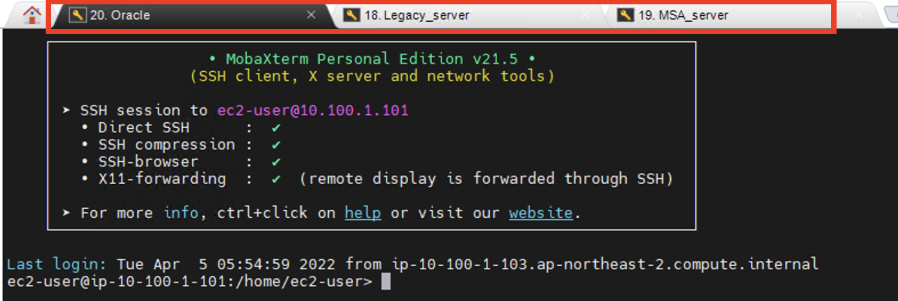
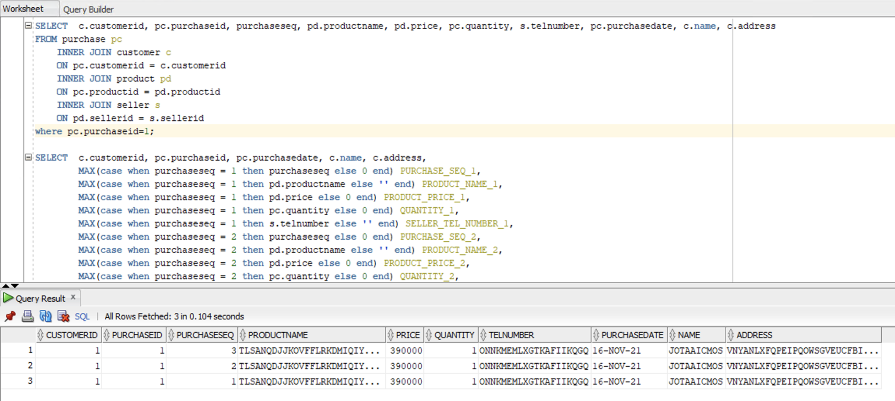
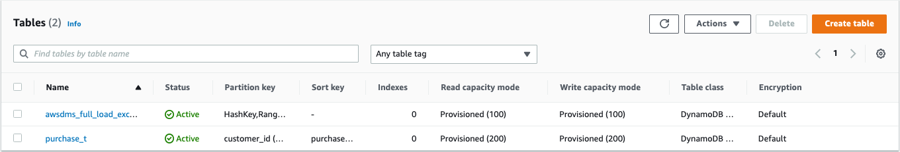
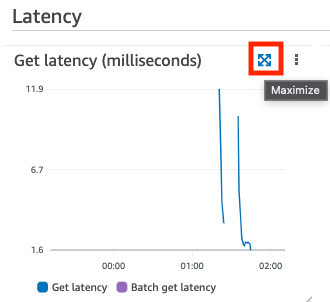
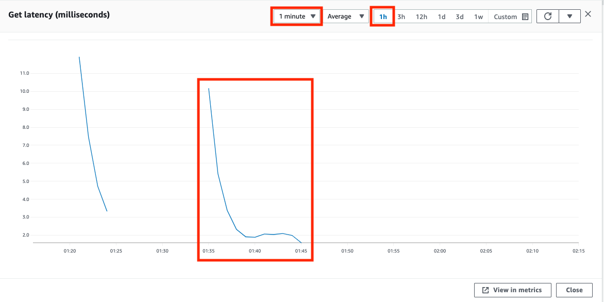

# Workshop04(DynamoDB를 활용하여 구매내역 조회 서비스  전환하기)
엔터프라이즈 모놀리틱 DB를 MSA 구조로 전환하기 세션의 Workshop04에 오신 것을 환영합니다.  
Workshop04 에서는 Oracle의 주문 조회용 데이터를 Amazon DynamoDB 로 마이그레이션해 보고, Gatling을 활용하여 부하 주입 및 성능 측정을 해보도록 하겠습니다.
### Architecture Diagram

### 시나리오 소개
~~~
당신은 온라인 마켓 서비스를 담당하고 있습니다.
OLTP 서비스에서 가장 일반적으로 사용되는 Oracle Database를 데이터 저장소로 사용하고 있습니다.
데이터 모델링 규칙에 맞추어 정규화된 여러 테이블들에 데이터들이 저장되고, 각 테이블들은 참조키로 관계가 맺어져 있습니다.
각 요청에 필요한 데이터들은 여러 테이블들을 조인하여 만들어지고 어플리케이션으로 전달됩니다.
서비스가 점점 확장됨에 따라 비지니스 규칙에 따라 정규화된 여러 테이블들에 데이터를 인서트하거나,
여러 테이블들을 조인해서 데이터를 조회하는 부담이 점점 늘어나고 있습니다.
향후 서비스의 확장을 대비하여 유연한 확장성과 고가용성, 일관된 성능을 보장하는 AWS 완전관리형의 serverless nosql DB인
DynamoDB 로 데이터를 마이그레이션 하려고 합니다.

이번 실습을 통해 간단한 구매내역 조회 서비스를 대상으로 Oracle 과 DynamoDB 성능 비교를 해보고,
데이터 마이그레이션은 DMS를 활용해봄으로서 RDB 에서 NoSQL 로 마이그레이션 하는 기본적인 방법을 배워봅니다.
~~~
# 작업에 필요한 MobaXterm Session 3개를 생성합니다.
1. Session을 생성하는 방법은 Workshop01의 Session 생성 단계를 참고 합니다.
2. Session의 이름을 각각 Oracle, Legacy_server, MSA_server 으로 변경합니다.



# Oracle to DynamoDB migration
### 1. Oracle 데이터 확인
Bastion server에 Taskbar에서 sqldeveloper아이콘을 클릭하여 sqldeveloper를 실행합니다.
   
oracle-oshop 오른쪽 마우스 클릭 후 팝업메뉴에서 Connect를 클릭합니다.
   
오른쪽 Worksheet에서 아래 두 쿼리를 각각 실행하여 데이터를 확인해 봅니다.   
첫번째 쿼리는 여러 테이블을 조인하여 데이터를 확인하는 쿼리이고, 두번째 쿼리는 첫번째 결과를 피버팅한 데이터를 보여주는 쿼리입니다.   
두번째 쿼리를 활용하여 DanamoDB로 데이터를 마이그레이션하기 위한 Staging 테이블을 구성할 것입니다.   
~~~ sql
# 구매번호(purchaseid) 1번에 해당하는 상품들의 정보를 표시합니다.
SELECT  c.customerid, pc.purchaseid, purchaseseq, pd.productname, pd.price, pc.quantity, s.telnumber, pc.purchasedate, c.name, c.address
FROM purchase pc
	INNER JOIN customer c
	ON pc.customerid = c.customerid
	INNER JOIN product pd
	ON pc.productid = pd.productid
    INNER JOIN seller s
    ON pd.sellerid = s.sellerid
where pc.purchaseid=1;
~~~
  
~~~ sql
# 위의 쿼리결과를 피버팅하는 쿼리입니다. 
# DynamoDB로 마이그레이션 하기 전에 이 쿼리를 통해 staging 테이블을 구성하게 됩니다.
SELECT  c.customerid, pc.purchaseid, pc.purchasedate, c.name, c.address,
        MAX(case when purchaseseq = 1 then purchaseseq else 0 end) PURCHASE_SEQ_1,
        MAX(case when purchaseseq = 1 then pd.productname else '' end) PRODUCT_NAME_1,
        MAX(case when purchaseseq = 1 then pd.price else 0 end) PRODUCT_PRICE_1,
        MAX(case when purchaseseq = 1 then pc.quantity else 0 end) QUANTITY_1,
        MAX(case when purchaseseq = 1 then s.telnumber else '' end) SELLER_TEL_NUMBER_1,
        MAX(case when purchaseseq = 2 then purchaseseq else 0 end) PURCHASE_SEQ_2,
        MAX(case when purchaseseq = 2 then pd.productname else '' end) PRODUCT_NAME_2,
        MAX(case when purchaseseq = 2 then pd.price else 0 end) PRODUCT_PRICE_2,
        MAX(case when purchaseseq = 2 then pc.quantity else 0 end) QUANTITY_2,
        MAX(case when purchaseseq = 2 then s.telnumber else '' end) SELLER_TEL_NUMBER_2,
        MAX(case when purchaseseq = 3 then purchaseseq else 0 end) PURCHASE_SEQ_3,
        MAX(case when purchaseseq = 3 then pd.productname else '' end) PRODUCT_NAME_3,
        MAX(case when purchaseseq = 3 then pd.price else 0 end) PRODUCT_PRICE_3,
        MAX(case when purchaseseq = 3 then pc.quantity else 0 end) QUANTITY_3,
        MAX(case when purchaseseq = 3 then s.telnumber else '' end) SELLER_TEL_NUMBER_3
FROM purchase pc
	INNER JOIN customer c
	ON pc.customerid = c.customerid
	INNER JOIN product pd
	ON pc.productid = pd.productid
    INNER JOIN seller s
    ON pd.sellerid = s.sellerid
where pc.purchaseid=1
group by c.customerid, pc.purchaseid, pc.purchasedate, c.name, c.address;
~~~
   
### 2. Oracle에 staging 테이블 구성
Oracle에 있는 데이터를 DynamoDB에 마이그레이션 하기 위해 DynamodDB의 key-value 형태에 맞게 staging 테이블을 만들어 줍니다.   
sqldeveloper에서 아래 쿼리를 수행합니다.   
마지막 COMMIT; 문장까지 수행해야 합니다.
~~~ sql
CREATE TABLE "OSHOP"."PURCHASE_DYNAMODB_FORMAT" 
(
    "CUSTOMER_ID" VARCHAR2(20 BYTE),
    "PURCHASE_ID" VARCHAR2(20 BYTE), 
    "PURCHASE_DATE" VARCHAR2(10 BYTE),
    "CUSTOMER_NAME" VARCHAR2(10 BYTE),    
    "CUSTOMER_ADDRESS" VARCHAR2(100 BYTE),
    "PURCHASE_SEQ_1" VARCHAR2(20 BYTE), 
    "PRODUCT_NAME_1" VARCHAR2(100 BYTE), 
    "PRODUCT_PRICE_1" VARCHAR2(20 BYTE), 
    "QUANTITY_1" VARCHAR2(20 BYTE), 
    "SELLER_TEL_NUMBER_1" VARCHAR2(20 BYTE), 
    "PURCHASE_SEQ_2" VARCHAR2(20 BYTE), 
    "PRODUCT_NAME_2" VARCHAR2(100 BYTE), 
    "PRODUCT_PRICE_2" VARCHAR2(20 BYTE), 
    "QUANTITY_2" VARCHAR2(20 BYTE), 
    "SELLER_TEL_NUMBER_2" VARCHAR2(20 BYTE), 
    "PURCHASE_SEQ_3" VARCHAR2(20 BYTE), 
    "PRODUCT_NAME_3" VARCHAR2(100 BYTE), 
    "PRODUCT_PRICE_3" VARCHAR2(20 BYTE), 
    "QUANTITY_3" VARCHAR2(20 BYTE), 
    "SELLER_TEL_NUMBER_3" VARCHAR2(20 BYTE), 
    CONSTRAINT "PURCHASE_DYNAMODB_FT_PK" PRIMARY KEY ("CUSTOMER_ID", "PURCHASE_ID")
);

INSERT INTO PURCHASE_DYNAMODB_FORMAT
SELECT  c.customerid, pc.purchaseid, pc.purchasedate, c.name, c.address,
        MAX(case when purchaseseq = 1 then purchaseseq else 0 end) PURCHASE_SEQ_1,
        MAX(case when purchaseseq = 1 then pd.productname else '' end) PRODUCT_NAME_1,
        MAX(case when purchaseseq = 1 then pd.price else 0 end) PRODUCT_PRICE_1,
        MAX(case when purchaseseq = 1 then pc.quantity else 0 end) QUANTITY_1,
        MAX(case when purchaseseq = 1 then s.telnumber else '' end) SELLER_TEL_NUMBER_1,
        MAX(case when purchaseseq = 2 then purchaseseq else 0 end) PURCHASE_SEQ_2,
        MAX(case when purchaseseq = 2 then pd.productname else '' end) PRODUCT_NAME_2,
        MAX(case when purchaseseq = 2 then pd.price else 0 end) PRODUCT_PRICE_2,
        MAX(case when purchaseseq = 2 then pc.quantity else 0 end) QUANTITY_2,
        MAX(case when purchaseseq = 2 then s.telnumber else '' end) SELLER_TEL_NUMBER_2,
        MAX(case when purchaseseq = 3 then purchaseseq else 0 end) PURCHASE_SEQ_3,
        MAX(case when purchaseseq = 3 then pd.productname else '' end) PRODUCT_NAME_3,
        MAX(case when purchaseseq = 3 then pd.price else 0 end) PRODUCT_PRICE_3,
        MAX(case when purchaseseq = 3 then pc.quantity else 0 end) QUANTITY_3,
        MAX(case when purchaseseq = 3 then s.telnumber else '' end) SELLER_TEL_NUMBER_3
FROM purchase pc
	INNER JOIN customer c
	ON pc.customerid = c.customerid
	INNER JOIN product pd
	ON pc.productid = pd.productid
    INNER JOIN seller s
    ON pd.sellerid = s.sellerid
group by c.customerid, pc.purchaseid, pc.purchasedate, c.name, c.address;

COMMIT;
~~~
 
### 3. DynamoDB로 마이그레이션
스태이징 테이블을 구성하였으니 DMS를 통해서 DynamoDB로 데이터를 마이그레이션 합니다.   
DMS의 Replication Instance는 Workshop01에서 생성한 RI를 사용합니다.   
만약 Workshop01을 수행하지 않았다면 Workshop01의 "Oracle DB의 JOIN DATA를 MongoDB로 마이그레이션"의 10번 단계를 참고하여 Replication Instance를 생성합니다.  

Replication Instance를 생성하였다면 [DMS Console](https://ap-northeast-2.console.aws.amazon.com/dms/v2/home?region=ap-northeast-2#dashboard) 에서 Source와 Target endpoint를 생성합니다.  
왼쪽 메뉴에서 Endpoints로 이동 후 Create endpoint 버튼을 클릭합니다.
아래와 같이 Source endpoint에 대한 정보를 입력합니다.
```
* Endpoint type : Source endpoint 선택
* Endpoint identifier : s-seoulsummit-endpoint
* Source engine : Oracle
* Provide access information manually 선택
* Server name : 10.100.1.101
* Port : 1521
* User name : oshop
* Password : oshop
* SID/Service name : xe   
```


VPC와 Replication instance 정보를 입력하고 Run test 버튼을 클릭하여 연결테스트를 수행합니다.
Test 가 성공하였다면 Create endpoint 버튼을 클릭합니다.  


Target endpoint를 생성하기 위해서 Create endpoint 버튼을 클릭합니다.
아래와 같이 Target endpoint 에 대한 정보를 입력합니다.

* Endpoint type : Target endpoint 선택
* Endpoint identifier : t-seoulsummit-dynamodb1
* Target engine : Amazon DynamoDB
* Service access role ARN : arn:aws:iam::111111111111:role/EC2SSMRole2
(Service access role ARN 은 AWS Console에서 [CloudFormation](https://ap-northeast-2.console.aws.amazon.com/cloudformation/home?region=ap-northeast-2#/stacks?filteringStatus=active&filteringText=&viewNested=true&hideStacks=false)으로 이동 후 seoul-summit 스택 Outputs 탭에서 확인할 수 있습니다.)  


Test endpoint connection을 수행합니다.


다음으로 데이터 마이그레이션을 위한 Task를 생성합니다. 
[Task](https://ap-northeast-2.console.aws.amazon.com/dms/v2/home?region=ap-northeast-2#tasks) 페이지로 이동하여 Create task 버튼을 클릭합니다.

Task configuration 항목에 값을 설정합니다.
Replication instnace 는 CloudFormation outputs 항목의 ReplicationInstance를 참고합니다.
Source와 Target endpoint는 이전 단계에서 만든 endpoint 정보를 입력합니다.  
* Task Identifier : task-seoulsummit-oracle-dynamodb
* Replication instance : ri-oracle-to-mongodb
* Source database endpoint : s-seoulsummit-endpoint
* Target database endpoint : t-seoulsummit-dynamodb1
* Migration type : Migrate existing data
   


Task settings를 아래와 같이 설정합니다.  


Table mappings 정보를 설정합니다.
JSON editor 버튼을 선택하고 아래 editor에 JSON 을 입력합니다.
~~~json
{
    "rules": [
        {
            "rule-type": "selection",
            "rule-id": "1",
            "rule-name": "1",
            "object-locator": {
                "schema-name": "OSHOP",
                "table-name": "PURCHASE_DYNAMODB_FORMAT"
            },
            "rule-action": "include"
        },
        {
            "rule-type": "object-mapping",
            "rule-id": "2",
            "rule-name": "TransformToDDB",
            "rule-action": "map-record-to-record",
            "object-locator": {
                "schema-name": "OSHOP",
                "table-name": "PURCHASE_DYNAMODB_FORMAT"
            },
            "target-table-name": "purchase_t",
            "mapping-parameters": {
                "partition-key-name": "customer_id",
                "sort-key-name": "purchase_id",
                "exclude-columns": [
                    "CUSTOMER_ID",
                    "PURCHASE_DATE",
                    "PURCHASE_ID",
                    "CUSTOMER_NAME",
                    "CUSTOMER_ADDRESS",
                    "PURCHASE_SEQ_1",
                    "PRODUCT_NAME_1",
                    "PRODUCT_PRICE_1",
                    "QUANTITY_1",
                    "SELLER_TEL_NUMBER_1",
                    "PURCHASE_SEQ_2",
                    "PRODUCT_NAME_2",
                    "PRODUCT_PRICE_2",
                    "QUANTITY_2",
                    "SELLER_TEL_NUMBER_2",
                    "PURCHASE_SEQ_3",
                    "PRODUCT_NAME_3",
                    "PRODUCT_PRICE_3",
                    "QUANTITY_3",
                    "SELLER_TEL_NUMBER_3"
                ],
                "attribute-mappings": [
                    {
                        "target-attribute-name": "customer_id",
                        "attribute-type": "scalar",
                        "attribute-sub-type": "string",
                        "value": "${CUSTOMER_ID}"
                    },
                    {
                        "target-attribute-name": "purchase_id",
                        "attribute-type": "scalar",
                        "attribute-sub-type": "string",
                        "value": "${PURCHASE_ID}"
                    },
                    {
                        "target-attribute-name": "purchase_details",
                        "attribute-type": "document",
                        "attribute-sub-type": "dynamodb-map",
                        "value": {
                            "M": {
                                "CUSTOMER_NAME": {
                                    "S": "${CUSTOMER_NAME}"
                                },
                                "CUSTOMER_ADDRESS": {
                                    "S": "${CUSTOMER_ADDRESS}"
                                },
                                "PRODUCT_NAME_1": {
                                    "S": "${PRODUCT_NAME_1}"
                                },
                                "PRODUCT_PRICE_1": {
                                    "S": "${PRODUCT_PRICE_1}"
                                },
                                "QUANTITY_1": {
                                    "S": "${QUANTITY_1}"
                                },
                                "SELLER_TEL_NUMBER_1": {
                                    "S": "${SELLER_TEL_NUMBER_1}"
                                },
                                "PRODUCT_NAME_2": {
                                    "S": "${PRODUCT_NAME_2}"
                                },
                                "PRODUCT_PRICE_2": {
                                    "S": "${PRODUCT_PRICE_2}"
                                },
                                "QUANTITY_2": {
                                    "S": "${QUANTITY_2}"
                                },
                                "SELLER_TEL_NUMBER_2": {
                                    "S": "${SELLER_TEL_NUMBER_2}"
                                },
                                "PRODUCT_NAME_3": {
                                    "S": "${PRODUCT_NAME_3}"
                                },
                                "PRODUCT_PRICE_3": {
                                    "S": "${PRODUCT_PRICE_3}"
                                },
                                "QUANTITY_3": {
                                    "S": "${QUANTITY_3}"
                                },
                                "SELLER_TEL_NUMBER_3": {
                                    "S": "${SELLER_TEL_NUMBER_3}"
                                }
                            }
                        }
                    }
                ]
            }
        }
    ]
}
~~~

마지막으로 Manually later를 선택하고 Create task 버튼을 클릭합니다.  


Task 생성이 완료되었으면 Task를 실행합니다.  


10만건 데이터를 마이그레이션하는데 14분 43초 소요되었습니다.


[DynamoDB](https://ap-northeast-2.console.aws.amazon.com/dynamodbv2/home?region=ap-northeast-2#tables) 이동하여 purchase_t 를 클릭합니다.


purchase_t 를 선택한 후 오른쪽 위에 "Explore table items"를 클릭합니다.  


데이터가 마이그레이션 된 것을 확인할 수 있습니다.


하나의 아이템을 선택하면 해당 아이템의 상세 데이터를 볼 수 있습니다.


# Oracle에서 구매내역 조회 테스트
### 1. 구매내역을 조회하는 Oracle 기반의 어플리케이션을 기동합니다.
MobaXterm의 Legacy_server에서 아래의 명령어를 수행합니다.
~~~
ec2-user@ip-10-100-1-101:/home/ec2-user> cd workshop04/legacy
ec2-user@ip-10-100-1-101:/home/ec2-user/workshop04/legacy> source bin/activate
(legacy) ec2-user@ip-10-100-1-101:/home/ec2-user/workshop04/legacy> flask run --host=0.0.0.0 --port=4000
 * Environment: production
   WARNING: This is a development server. Do not use it in a production deployment.
   Use a production WSGI server instead.
 * Debug mode: off
 * Running on all addresses.
   WARNING: This is a development server. Do not use it in a production deployment.
 * Running on http://10.100.1.101:4000/ (Press CTRL+C to quit)
~~~
### 2. Gatling을 사용하여 legacy 시스템(오라클)에 구매내역 조회 부하를 주입하고 어플리케이션 성능을 측정합니다.
아래 명령어는 Bastion Server의 Command Prompt에서 실행합니다.

~~~
C:\Users\Administrator> CD C:\gatling\bin
C:\gatling\bin> gatling.bat
GATLING_HOME is set to "C:\gatling"
JAVA = "java"
Choose a simulation number:
     [0] SeoulSummit.Workshop02_legacy
     [1] SeoulSummit.Workshop02_msa
     [2] SeoulSummit.Workshop04_legacy
     [3] SeoulSummit.Workshop04_msa
2(2번 시나리오를 수행합니다.)
Select run description (optional)
(엔터를 한번 더 입력합니다.)
Simulation SeoulSummit.Workshop04_legacy started...

================================================================================
2022-03-06 20:42:11                                           5s elapsed
---- Requests ------------------------------------------------------------------
> Global                                                   (OK=114    KO=0     )
> selectPurchase                                           (OK=114    KO=0     )

---- Workshop04_legacy ---------------------------------------------------------
          active: 2      / done: 114
================================================================================
~~~
부하가 종료된 후 성능 통계정보를 확인합니다. p95의 평균 응답시간은 92ms 입니다.

   
위의 링크를 웹브라우저로 열어서 Web으로 제공되는 성능 보고서도 확인해 봅니다.


MobaXterm Legacy_server로 이동 후 ctrl+C로 어플리케이션을 중지합니다.
~~~
10.100.1.103 - - [07/Apr/2022 15:05:29] "GET /legacy/selectPurchase HTTP/1.1" 200 -
^C(legacy) ec2-user@ip-10-100-1-101:/home/ec2-user/workshop04/legacy>
~~~

### 3. Gatling을 이용하여 DynamoDB 기반의 구매 내역 조회 어플리케이션 성능을 확인합니다.
MobaXterm MSA_Server 세션으로 이동하여 어플리케이션을 실행합니다.
~~~
ec2-user@ip-10-100-1-101:/home/ec2-user> cd workshop04/msa
ec2-user@ip-10-100-1-101:/home/ec2-user/workshop04/msa> source bin/activate
(msa) ec2-user@ip-10-100-1-101:/home/ec2-user/workshop04/msa> flask run --host=0.0.0.0 --port=4000
 * Environment: production
   WARNING: This is a development server. Do not use it in a production deployment.
   Use a production WSGI server instead.
 * Debug mode: off
 * Running on all addresses.
   WARNING: This is a development server. Do not use it in a production deployment.
 * Running on http://10.100.1.101:4000/ (Press CTRL+C to quit)
~~~
Gatling으로 부하테스트를 수행합니다.   
부하테스트는 Cloudwatch 지표를 표시하기 위해서 10분 동안 수행되도록 하였습니다.(Cloudwatch가 1분 평균 그래프이기 때문에 부하 시간이 너무 짧을 경우 그래프가 명확하게 표시되지 않습니다.)
아래 명령어는 Bastion Server의 Command Prompt에서 실행합니다.


~~~
C:\Users\Administrator> CD C:\gatling\bin
C:\gatling\bin> gatling.bat
GATLING_HOME is set to "C:\gatling"
JAVA = "java"
Choose a simulation number:
     [0] SeoulSummit.Workshop02_legacy
     [1] SeoulSummit.Workshop02_msa
     [2] SeoulSummit.Workshop04_legacy
     [3] SeoulSummit.Workshop04_msa
3(3번 시나리오를 수행합니다.)
Select run description (optional)
(엔터를 한번 더 입력합니다.)
Simulation SeoulSummit.Workshop04_msa started...

================================================================================
2022-03-06 20:51:06                                           5s elapsed
---- Requests ------------------------------------------------------------------
> Global                                                   (OK=219    KO=0     )
> selectPurchase                                           (OK=219    KO=0     )

---- Workshop04_msa ------------------------------------------------------------
          active: 2      / done: 219
================================================================================
~~~
부하가 종료된 후 성능 통계정보를 확인합니다. p95의 평균 응답시간은 56ms 입니다.

   
위의 링크를 웹브라우저로 열어서 Web으로 제공되는 성능 보고서도 확인해 봅니다.


   
[Cloudwatch지표](https://ap-northeast-2.console.aws.amazon.com/dynamodbv2/home?region=ap-northeast-2#table?initialTagKey=&name=purchase_t&tab=monitoring)를 확인해 봅니다.   
Latency 카테고리에 Get latency 지표 그래프를 확대합니다.   


처음에는 latency가 높지만 점점 낮아지며 2ms의 latency를 안정적으로 유지하는 것을 볼 수 있습니다.
하지만 End to End의 전체 구간에 걸친 응답속도는 어플리케이션, 네트워크, 인스턴스의 리소스 상황 등 여러 요소에 영향을 받아 DynamoDB에서 보여주는 지표보다 더 높아진다는 것을 기억하시길 바랍니다.

~~~
이번 Workshop에서는 Oracle data를 DynamoDB로 DMS를 활용하여 마이그레이션해 보았습니다.
또 Gatling을 통해 각각의 서비스에 대해서 구매상세조회 단위기능을 테스트 해보고 성능을 비교해 볼 수 있었습니다.
DynamoDB의 사용하여 사용자가 늘어나는 상황에서도 10ms 미만의 빠른 응답속도를 보장하고 
schemaless특성을 활용하여 유연하고 빠른 어플리케이션 개발이 가능하게 되었습니다.
~~~


