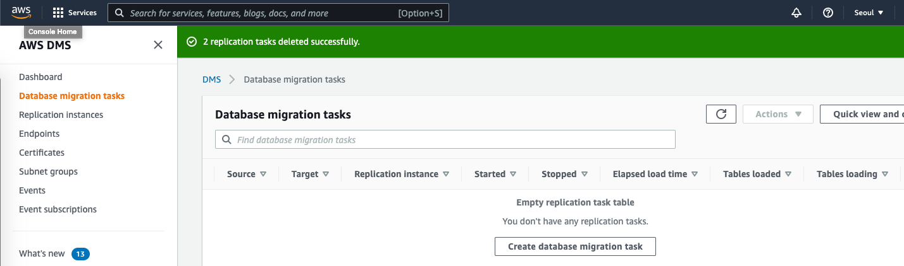

### 축하드립니다, 모든 Workshop을 완료하였습니다. 

### 이제 Workshop에서 사용한 Resource와 Service들을 모두 삭제 하겠습니다. 

### 사용한 리소스의 삭제가 완전하게 되지 않을 경우 AWS 서비스 이용 비용이 과금 될 수 있습니다. 꼭!! 모든 리소스를 삭제 해주세요.

---

#### DMS 관련 리소스 삭제

---

1. Services => Database Migration Services로 이동

---

2. 화면 좌측의 "Database migration tasks(데이터베이스 마이그레이션 태스크)" Click

---

3. oracle-csharch-to-mongodb, task-seoulsummit-oracle-dynamodb 앞의 체크 박스에 체크를 선택하고 Actions(작업) => Delete(삭제)를 선택합니다.

---

4. 화면 좌측의 "Endpoints(엔드포인트)"를 Click

5. 다음 4개의 Endpoints를 모두 선택하고 삭제합니다. Actions(작업) => Delete(삭제)

---

6. 화면 좌측의 "Replication Instances(복제 인스턴스)"를 Click
7. "ri-oracle-to-mongodb" 옆의 체크 박스를 체크하고 Actions(작업) => Delete(삭제)

---

---

#### DYNAMODB Table 삭제

---

1. Services => DYNAMODB 이동

---

2. 화면 좌측의 Tables(테이블) Click
3. awsdms_full_load_exceptions, purchase_t 옆의 체크박스를 선택하고 Delete(삭제)

---

4. Delete all CloudWatch alarms for the tables shown(표시된 테이블에 대한 모든 CloudWatch 경보를 삭제합니다.)만 선택
5. To confirm the deletion of these tables, type delete in the box.(이 테이블의 삭제를 확인하려면 상자에 삭제을(를) 입력합니다.)에 delete(삭제)를 입력하고 "Delete tables(테이블 삭제)" Click

---

---

#### CloudFormation Stack 삭제

---

1. Services => CloudFormation 이동

---

2. 화면 좌측 "Stacks(스택)" Click
3. "DBforMSA" Stack을 선택하고, Delete(삭제) Click, 확인창이 뜨면 "Delete Stack" Click

---

4. DBforMSA를 Click 하고 Events(이벤트)를 Click하여 삭제 작업 진행 상황 확인

---

5. Stack이 삭제 된 것을 확인합니다.

